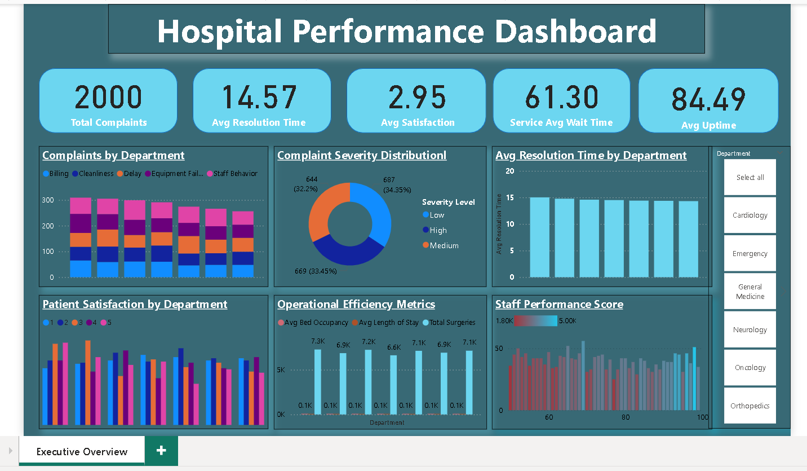

# Hospital Feedback and Service Quality Analysis (Power BI)

## Project Overview
Patient satisfaction and service quality are key indicators of hospital performance.
This project analyzes patient feedback and service quality metrics using Microsoft Power BI to provide actionable insights for hospital administrators and quality assurance teams.

## 📊 Dashboard Preview

## Business Problem
Traditional hospital feedback systems are often manual and fragmented, making it difficult to identify service quality issues in a timely manner.
This project provides a centralized and interactive dashboard to monitor patient satisfaction and service quality effectively.

## Objectives
- Analyze patient satisfaction and service quality metrics
- Identify trends in wait time, cleanliness, billing transparency, and staff responsiveness
- Perform sentiment analysis on open-ended patient feedback
- Support data-driven decision-making through interactive dashboards

## Key Features
- KPI analysis: wait time, satisfaction score, cleanliness, doctor–patient interaction
- Department-wise service quality comparison
- Complaint severity distribution
- Interactive filters for departments and time periods

## Tools & Technologies
- Microsoft Power BI
- Power Query
- DAX
- Excel / CSV data sources

## Data
- Type: Sample / anonymized hospital feedback data
- Sources: Patient surveys and complaint records
- Note: No real patient-identifiable data is used

## How to View
- Download the `.pbix` file
- Open it using **Power BI Desktop**
